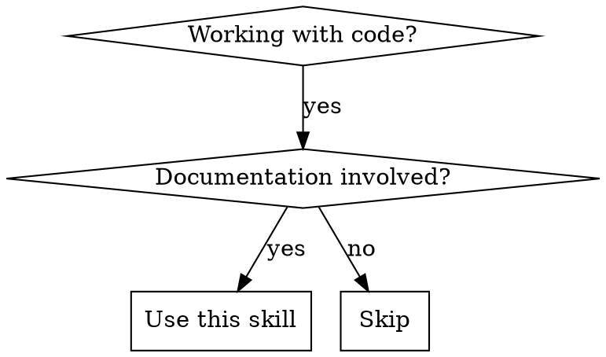

# Documenting Code

## Overview

**Keep documentation in sync with code - always.**

Documentation changes when code changes. No exceptions.

## When to Use



**Use for:**
- Creating new documentation (API docs, user guides, feature docs)
- Updating documentation after code changes
- Checking documentation consistency
- Generating documentation from code

**Symptoms that indicate you need this:**
- Documentation is outdated or missing
- Code behavior doesn't match documentation
- Don't know which docs need updating after code changes
- Starting a new feature and need to document it

**NOT for:**
- Pure text editing without code context
- Non-code documentation (meeting notes, personal journals)

## Core Pattern

```
Before: Code change → Commit → Documentation forgotten (out of sync)

After:  Code change → Check documentation → Update → Commit (in sync)
```

## Quick Reference

| Task | Trigger | Action |
|------|---------|--------|
| **New code** | Just implemented a feature | Ask: Who is the audience? What type of doc? |
| **Code change** | Modified existing code | Find all affected docs, update before commit |
| **Inconsistency** | Found mismatch between code and docs | Check both, determine which is correct |
| **Missing docs** | Code has no documentation | Create based on code analysis |

## Implementation

### Step 1: Always Check Documentation Status

Before committing code changes:

```bash
# Find documentation related to changed code
grep -r "ClassName" docs/
grep -r "functionName" docs/
grep -r "/api/endpoint" docs/
```

**Red Flags - STOP and Check:**
- 🚨 Code changed but documentation not checked
- 🚨 "I'll update docs later" (never happens)
- 🚨 "Emergency/deadline" (urgency doesn't justify breaking sync)
- 🚨 "Docs are not important" (wrong - out-of-sync docs are production risk)

### Step 2: Identify Documentation Type

**MUST ask user when not clear:**

1. **Who is the audience?**
   - End users (functionality, how-to)
   - Developers (API reference, internals)
   - Contributors (guidelines, workflows)
   - Mixed (specify which sections)

2. **What type of documentation?**
   - API documentation (endpoints, parameters, return values)
   - User guide (how to use a feature)
   - Reference (syntax, configuration options)
   - Architecture/design (why and how it works)

**Never assume. Ask first.**

**CRITICAL**: If you ask the user a question, you MUST wait for their response before proceeding. Do NOT assume their answer or continue without it.

### Step 3: Update or Create

**For existing documentation:**

1. Compare code behavior with documentation
2. Identify differences (added/removed/changed)
3. Update documentation to match current code
4. Verify all examples still work

**For new documentation:**

1. Analyze code structure (classes, functions, endpoints)
2. Extract key information (parameters, return types, behaviors)
3. Organize into appropriate structure for the type
4. Add examples based on actual code usage

### Step 4: Quality Checklist

Before finalizing:

- [ ] All public APIs documented
- [ ] Parameter types and descriptions correct
- [ ] Return values documented
- [ ] Examples are accurate and runnable
- [ ] Terminology is consistent
- [ ] Cross-references are valid
- [ ] Code examples match current implementation

## Common Mistakes

| Mistake | Why It Happens | Fix |
|---------|----------------|-----|
| **Docs not updated after code change** | "Forgot", "in a hurry" | Check docs before every commit |
| **Wrong audience** | Assumed instead of asked | Always ask: "Who is this for?" |
| **Outdated examples** | Code changed, examples didn't | Verify all examples when updating |
| **Missing information** | Focused on code, forgot context | Use checklist above |
| **Inconsistent terminology** | Multiple contributors | Create terminology table, check against it |

## Rationalization Blockers

| Excuse | Reality |
|--------|---------|
| "I'll update docs later" | You won't. Later = never. Update now. |
| "Emergency/deadline" | Urgent deployment with wrong docs is worse. |
| "The change is minor" | Minor changes accumulate into major divergence. |
| "This doesn't affect the docs" | If code changed, docs need checking. Always. |
| "User didn't respond, so I continued" | Wait for response. Assumptions create wrong docs. |
| "Nobody reads docs anyway" | Wrong. Wrong docs are worse than no docs. |
| "I don't know which docs to update" | Search for references. If none, create. |
| "Too much work" | Updating now takes 5 minutes. Fixing later takes hours. |

**All of these mean: Update documentation NOW.**

## Example: API Documentation

### Before (Code Change Without Doc Update)

```java
// LoginRequest.java - Added deviceId field
public class LoginRequest {
    private String username;
    private String password;
    private String deviceId;  // NEW
}
```

Commit: "feat: add device tracking" → Documentation NOT updated → **OUT OF SYNC**

### After (Using This Skill)

```java
// Same code change
```

**Check documentation:**
```bash
grep -r "LoginRequest" docs/
# Found: docs/api/authentication.md
```

**Compare and update:**
```markdown
## POST /v1/auth/login

### Request Body
| Field | Type | Required | Description |
|-------|------|----------|-------------|
| username | string | Yes | Username |
| password | string | Yes | Password |
| deviceId | string | No | Device identifier (NEW) |
```

Commit: "feat: add device tracking + update auth docs" → **IN SYNC**

## Red Flags - STOP and Read This Skill

If you catch yourself thinking:
- "I'll update the documentation later"
- "This is just a quick fix"
- "The documentation is probably fine"
- "I don't have time to check docs"
- "I'll assume the audience is..."

**STOP. Read this skill. Update documentation NOW.**

## Documentation Type Reference

### API Documentation

**Structure:**
- Endpoint description
- HTTP method and path
- Request parameters (path, query, body)
- Response format and status codes
- Authentication requirements
- Rate limits (if applicable)
- Example requests/responses

**Source from:**
- Function signatures
- API route definitions
- Request/response DTOs
- Validation rules

### User Guide

**Structure:**
- Feature overview
- Use cases
- Step-by-step instructions
- Screenshots/diagrams
- Troubleshooting

**Source from:**
- Feature implementation
- UI components
- User flows
- Error messages

### Reference Documentation

**Structure:**
- Configuration options
- Command syntax
- Data structures
- Error codes

**Source from:**
- Configuration files
- Schema definitions
- Enum/constants
- Validation rules

---

**Iron Law**: Code committed without documentation update is incomplete work.

Fix it. Update the docs. Then commit.
